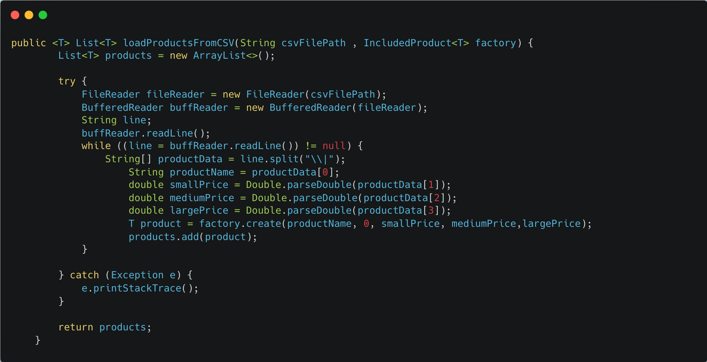
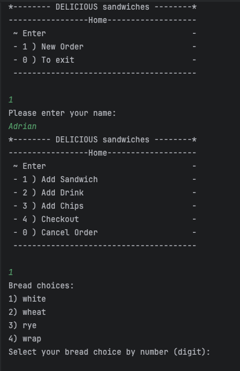
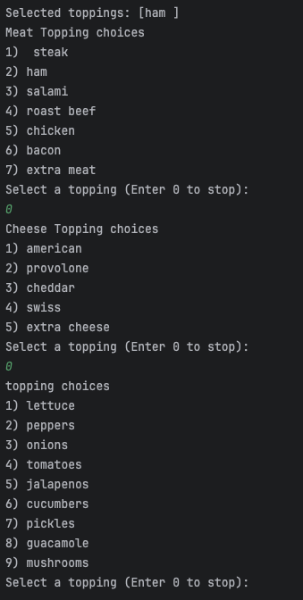
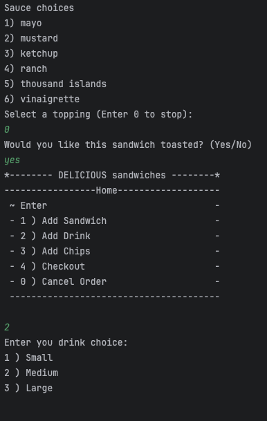
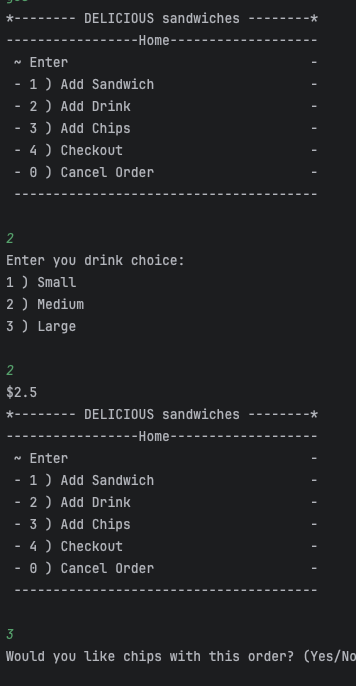
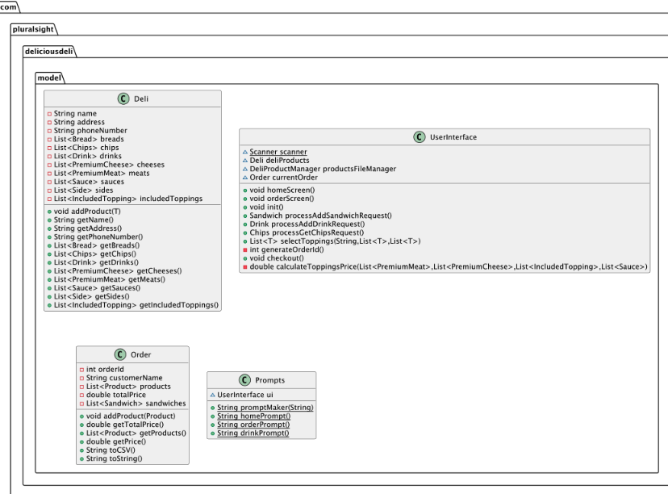
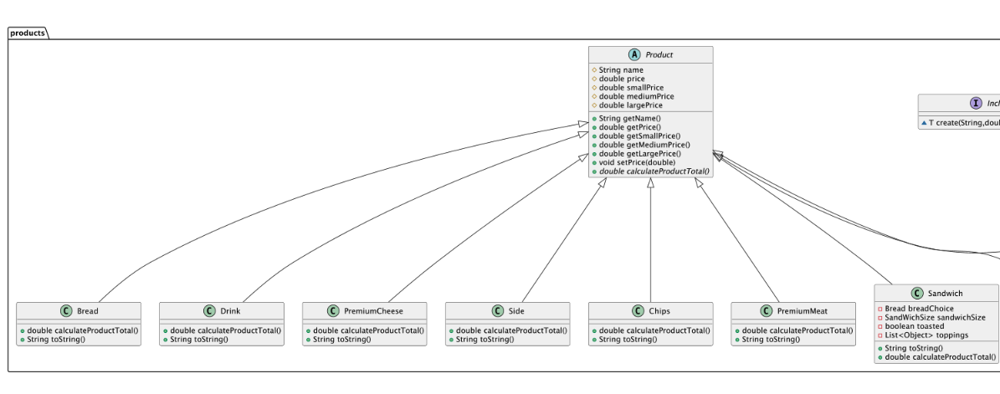
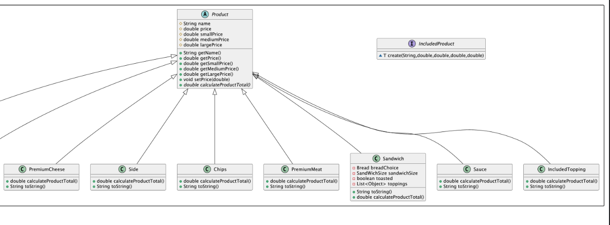
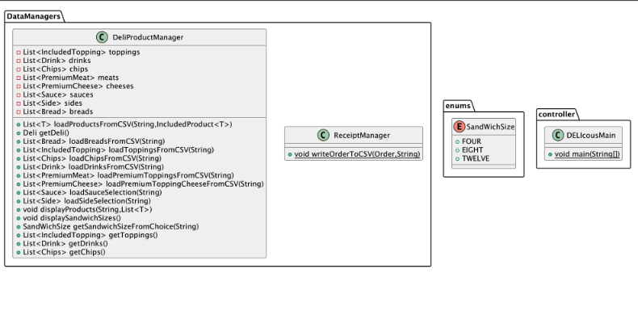
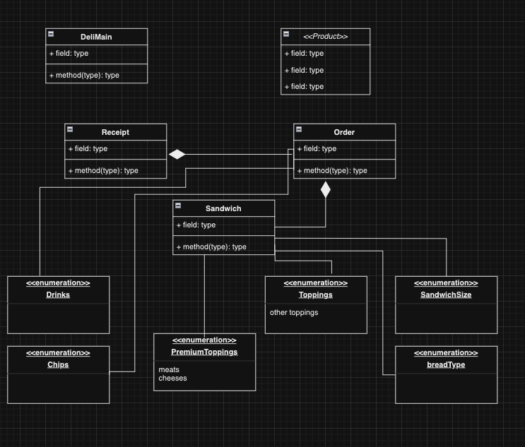

---
## -------------------------- 📑 Description 📑 ------------------------------
The DELI-cious Deli App is designed to simulate an ordering system for a sandwich
shop.The program allows users to create custom sandwiches by selecting sandwich 
size and ingredients. They can also add drinks and chips to there order. This application
implements enum classes, generic types, and other object-oriented programming concepts.
---

## ----------------------- 💻 Key Code Example 💻 -----------------------

# 👾 Generic Type Method 👾

We learned about Generic types in class, and they caught my attention. I knew that I wanted to learn more about
them and implement them into my project for more DRY code. In this example I made a generic method that reads data
from a CSV file and creates a list of products based on that data. It also implements an interface named IncludedProduct.
It is a functionalInterface and holds the method to create a product. 
---

## ------------------------------ 📺 App Screens 📺 -------------------------

---

---

---

---

## ------------------------------ 🗺️ UML Diagram 🗺️ -----------------------

---

## ------------------------- 🗺️ UML Diagram Draft 🗺️ ---------------------

- This is the uml diagram draft that I created. 

---